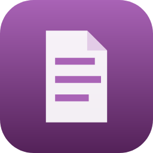

<p align="center">
  
</p>

<h1 align="center">PDF Editor</h1>

<p align="center"><b>Edit PDFs like a design app. Click the text. Type. Done.</b></p>

---

You know the drill: you just need to fix one typo in a PDF, and suddenly
you're staring at a $20/month subscription, a "free" trial asking for your
card, or some sketchy website that wants you to *upload your contract to
who-knows-where*. Yeah, no thanks.

PDF Editor is a small, fast Windows app that opens your PDF and lets you
edit it the way you always assumed should be possible. And the whole thing
runs on **your** computer — your files never go anywhere.

## What it does

- **Edit the actual text** — click any line, retype it, and it keeps the
  document's own fonts. Like it was never touched.
- **Move stuff around** — text, images, whatever. Drag, resize, rotate,
  with smart snapping guides so things line up.
- **Add things** — new text, your own images, highlights, pen drawings,
  shapes, lines.
- **Page surgery** — rotate pages, delete them, add blank ones, hide pages
  from the export, or reset a page if you've made a beautiful mess.
- **Fonts on tap** — use the document's fonts, grab any Google Font by
  name, or drop in your own TTF/OTF.
- **The shortcuts you'd expect** — undo/redo, copy/paste across pages,
  duplicate, Ctrl+S to save. Your muscle memory just works.
- **Clean exports** — the downloaded PDF is compact and stays a real PDF
  (actual selectable text, not a screenshot pretending to be one).

## Is it really free?

Yep. **Free forever.** No subscription, no account, no watermark, no
"premium" button lurking in a corner. There's no catch — this exists
because editing a PDF shouldn't cost more than the document is worth.

## Your files stay yours

Everything happens locally on your PC. The app doesn't upload, sync,
collect, or phone home about your documents — ever. The only thing it
fetches from the internet is fonts (when you ask for one). Full details in
[PRIVACY.md](PRIVACY.md).

## How to get it

- 🛒 **Microsoft Store** — coming soon! One-click install, automatic
  updates, zero warnings. This will be the easiest way.
- 💾 **Direct download** — grab `PDFEditor.exe` from the
  [Releases page](../../releases) and just run it. No installer, no admin
  rights. Heads up: since the direct download isn't store-signed yet,
  Windows may show an "unrecognized app" screen the first time — click
  **More info → Run anyway**. That's Windows being cautious with new apps,
  not an actual problem.

## AI integration (MCP)

The editor is an MCP server: connect Claude (or any MCP client) and say
*"fix the date on page 3 and bold the heading"* — and watch it happen
live in the editor window. The AI can do everything you can: retype text
in the document's own fonts, move and restyle objects, add text, images
and shapes, manage pages, design whole documents from a blank page, and
save a real PDF. Everything still runs 100% locally.

**Connect Claude Code** (with the app running):

```
claude mcp add --transport http pdf-editor http://127.0.0.1:52125/mcp
```

**Connect Claude Desktop:** Settings → Connectors → Add custom
connector → `http://127.0.0.1:52125/mcp`.

The app listens on port `52125` (if taken, the actual port is written to
`%LOCALAPPDATA%\PDFEditor\port.txt`). Tools the AI gets: `pdf_status`,
`pdf_open`, `pdf_new`, `page_read`, `page_render` (it can *see* the
page), `page_edit`, `page_op`, `fonts`, `pdf_save`. You and the AI edit
the same live objects — your undo, autosave and download keep working,
and the window updates within ~2 seconds of every AI edit.

## What's next

- More edit tools, more polish, and whatever you ask for — open an
  [issue](../../issues) if something's missing or misbehaving.

## Who made this

Built and owned by **Majed Aljunaidy**. If this app saved you from a PDF
subscription, that's the whole point — tell a friend.

---

<p align="center">Made with ☕ and a healthy dislike of paywalls.</p>
